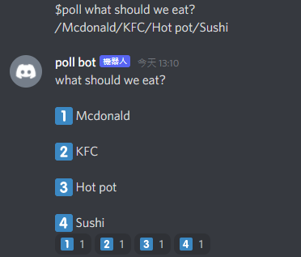

# discord_poll_bot
This is a poll bot create with python and flask
## bot commands
`$poll {question}?/option1/option2/.../option n`
## example
`$poll what should we eat? /Mcdonald/KFC/Hot pot/Sushi`  

